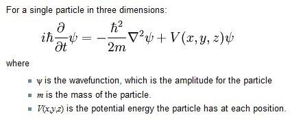

## **☕ About me**
I'm Dikra 19 yo from Algeria, i like tinkering with random stuff like coding.

 
###### (this beauty gif is not mine)

## **💻 Experience**

I'm currently studying Computer engineering, and I am still learning. I don't have anything special, but I hope to be able to change that in the future.

## **📊 Github Stats**
 
 

<!---
Dikradev/Dikradev is a ✨ special ✨ repository because its `README.md` (this file) appears on your GitHub profile.
You can click the Preview link to take a look at your changes.
--->

<h3 align="left">Languages and Tools:</h3>

                 <a href="https://www.python.org" target="_blank" rel="noreferrer">  

## ψ Schrödinger equations

According to my experience with equations, the most difficult equation for me was the "Schrödinger"

### ✍️ Random Dev Quote

---

